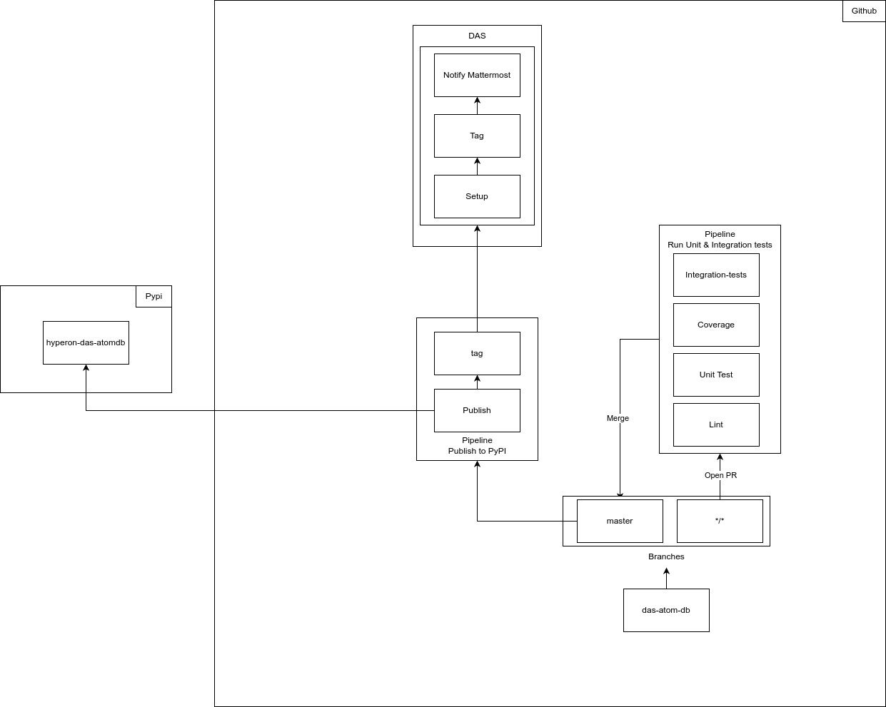
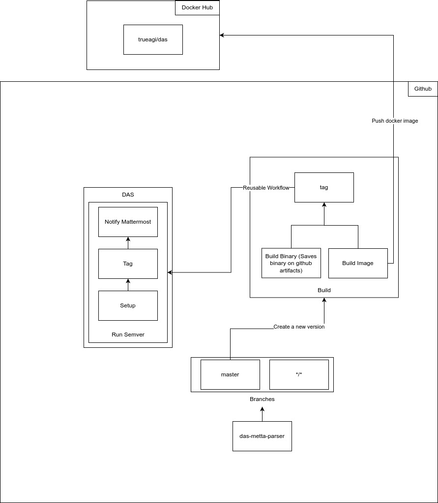
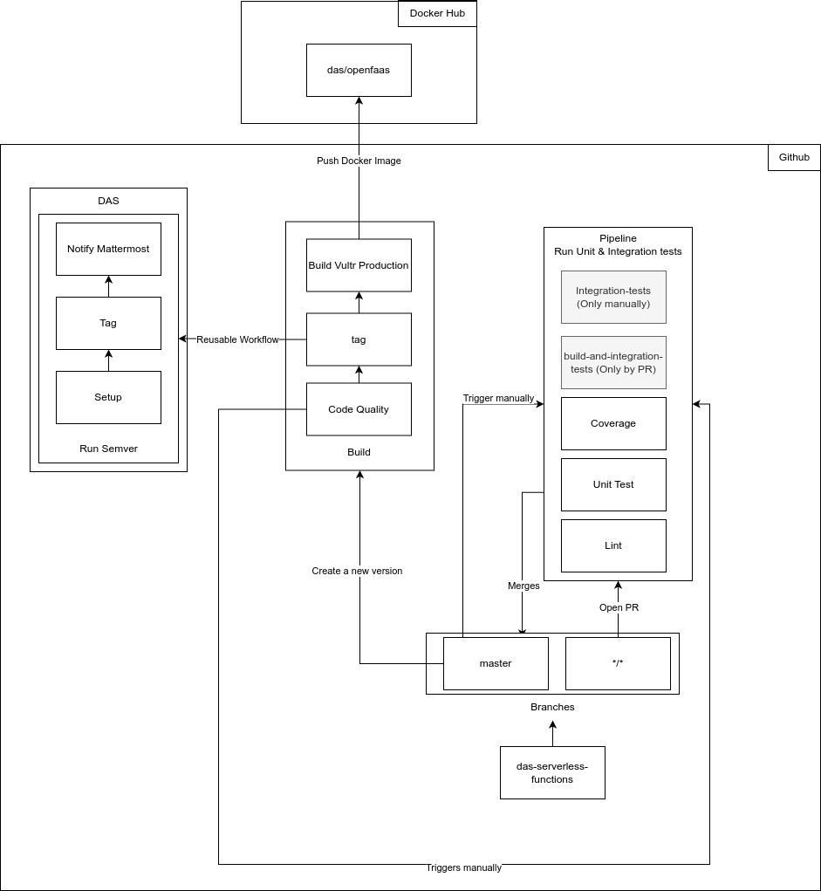
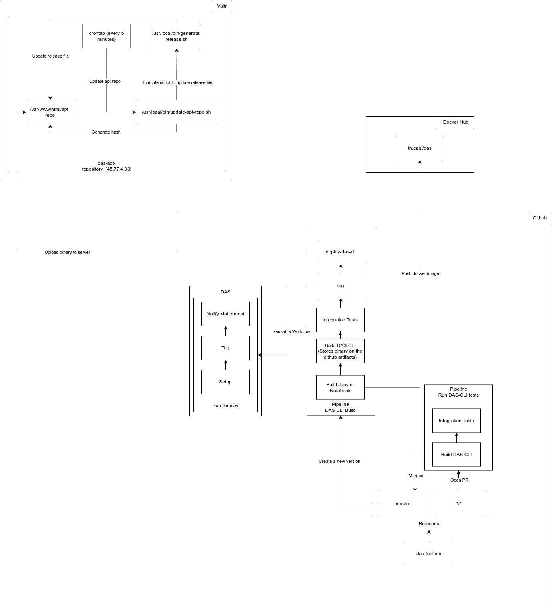

## AtomDB

The process involves the following key phases:

1. **Branches**
   - The project is developed based on two main branches:
     - Main branch: `master`
     - Feature and development branches: any branch created during development (represented as `/*` in the diagram).
2. **Opening Pull Requests (PR)**

   - During development, developers create branches for new features or fixes and open Pull Requests to the `master` branch.

3. **Test Pipeline**

   - When a PR is opened, a CI pipeline is triggered to ensure code quality. This pipeline executes the following steps:
     - **Lint:** Checks if the code adheres to style and quality standards.
     - **Unit Test:** Runs unit tests to validate the behavior of individual code units.
     - **Coverage:** Calculates test coverage to verify which parts of the code are being tested.
     - **Integration Tests:** Runs integration tests to check the interaction between different system components.

4. **Merge into `master`**
   - After PR approval, the code is merged into the `master` branch, but the deployment process is not triggered automatically; it needs to be triggered manually.

### Deployment and PyPI Publishing Process

1. **Publishing Pipeline**
   - After the merge into the `master` branch, a publishing pipeline is triggered to deploy the new version to PyPI using **Poetry**. The pipeline follows these steps:
     - **Tag:** Generates a tag for the new version.
     - **Publish:** Publishes the `hyperon-das-atomdb` package to PyPI using **Poetry**. The `poetry publish` command is used to package and upload the project to PyPI.
2. **Mattermost Notification**

   - After the publishing process, a notification is automatically sent to the Mattermost channel to announce the newly published version.

3. **Update on PyPI**
   - The `hyperon-das-atomdb` package is made available on PyPI, where it can be downloaded and installed by other projects.

### Component Details

1. **DAS**

   - The DAS orchestrates the publishing flow and performs the following tasks:
     - **Setup:** Configures the necessary environment for deployment.
     - **Tag:** Generates a version tag based on recent changes.
     - **Notify Mattermost:** Sends a notification to the appropriate Mattermost channel after a successful deployment.

2. **Integration with PyPI using Poetry**
   - The project is configured to automatically publish the package to PyPI after merging, using **Poetry** as the package management and publishing tool.
   - The publishing process includes:
     - Creating a version tag.
     - Publishing the package to PyPI.

## Query Engine

The process includes the following phases:

1. **Branches**

   - The project is developed with the following branches:
     - Main branch: `master`
     - Feature and development branches: represented as `/*`, created during the development process.

2. **Pull Requests (PR)**

   - Developers create new branches for features or bug fixes and open Pull Requests to merge into the `master` branch.

3. **Testing Pipeline**

   - A CI pipeline is triggered when a PR is opened, running the following steps:
     - **Lint:** Ensures the code adheres to style and quality standards.
     - **Unit Test:** Executes unit tests to validate individual components of the code.
     - **Coverage:** Measures the code coverage to ensure proper testing.
     - **Integration Tests:** Verifies the interaction between different components of the system.

4. **Merge into `master`**
   - After PR approval, the code is merged into the `master` branch, but the deployment process is not triggered automatically; it needs to be triggered manually.

### Deployment and Publishing to PyPI

1. **Publishing Pipeline**

   - After the code is merged into `master`, a pipeline is triggered to deploy the package to PyPI using **Poetry**. The process follows these steps:
     - **Tag Creation:** A tag for the new version is generated.
     - **Publish to PyPI:** The package `das-query-engine` is published to PyPI via the `poetry publish` command.

2. **Mattermost Notifications**

   - After the publishing process, an automated notification is sent to a Mattermost channel to inform about the new release.

3. **PyPI Availability**
   - The package `das-query-engine` is now available on PyPI for other projects to download and install.

### Component Breakdown

1. **DAS (Deploy Automation System)**

   - The DAS automates the deployment process and handles the following tasks:
     - **Setup:** Prepares the environment for deployment.
     - **Tag Generation:** Creates a version tag based on recent changes.
     - **Mattermost Notification:** Sends an automated notification to a designated Mattermost channel after a successful deployment.

2. **Poetry and PyPI Integration**
   - The project is set up to automatically publish the package to PyPI after the merge using **Poetry**.
   - The publishing process involves:
     - Tagging the new version.
     - Publishing the package to PyPI.

## DAS Metta Parser

The process involves the following key phases:

1. **Branches**
   - The project is developed based on two main branches:
     - Main branch: `master`
     - Feature and development branches: any branch created during development (represented as `/*` in the diagram).

2. **Opening Pull Requests (PR)**
   - During development, developers create branches for new features or fixes and open Pull Requests to the `master` branch to initiate the review and merging process.

3. **Test Pipeline**
   - When a PR is opened, a CI pipeline is triggered to ensure code quality. This pipeline executes the following steps:
     - **Lint:** Verifies if the code follows predefined style and quality standards.
     - **Unit Test:** Executes unit tests to validate individual parts of the code.
     - **Coverage:** Assesses the coverage to ensure sufficient testing across the codebase.
     - **Integration Tests:** Runs integration tests to validate the interaction between different components of the system.

4. **Merge into `master`**
   - After PR approval, the code is merged into the `master` branch, triggering the build and deployment processes.

### Build and Docker Image Publishing Process

1. **Build Pipeline**
   - After the merge into the `master` branch, a pipeline is triggered to build and deploy a new Docker image. The pipeline follows these steps:
     - **Build Binary:** A binary version of the code is built and saved as a GitHub artifact.
     - **Build Image:** A Docker image is built from the binary.
     - **Tag:** A version tag is created to uniquely identify the build.
     - **Push Docker Image:** The built Docker image is automatically pushed to Docker Hub under the `trueagi/das` repository.

2. **Mattermost Notification**
   - After the Docker image is pushed to Docker Hub, a notification is sent to the Mattermost channel to inform the team about the new deployment and version update.

3. **Docker Hub Availability**
   - The `trueagi/das` Docker image is now available on Docker Hub for use in deployment and further development.

### Component Details

1. **DAS (Deploy Automation System)**
   - DAS orchestrates the entire deployment process and performs the following tasks:
     - **Setup:** Prepares the environment and prerequisites for building and deployment.
     - **Tag:** Generates a version tag based on the current build.
     - **Notify Mattermost:** Sends a notification to the appropriate Mattermost channel about the successful build and deployment.

2. **Integration with Docker Hub**
   - The project is configured to automatically push the Docker image to Docker Hub after a successful build. The process includes:
     - Building the Docker image from the binary.
     - Pushing the image to Docker Hub under the `trueagi/das` repository.
     - Tagging the new version to keep track of updates and changes.

## DAS-Serverless-Functions

The process involves the following key phases:

1. **Branches**
   - The project is developed based on two main branches:
     - Main branch: `master`
     - Feature and development branches: any branch created during development (represented as `/*` in the diagram).

2. **Opening Pull Requests (PR)**
   - During development, developers create branches for new features or fixes and open Pull Requests to the `master` branch to initiate code review and merging.

3. **Test Pipeline**
   - When a PR is opened, a CI pipeline is triggered to ensure code quality. This pipeline executes the following steps:
     - **Lint:** Ensures the code adheres to predefined style and quality standards.
     - **Unit Test:** Executes unit tests to validate the functionality of individual components.
     - **Coverage:** Measures the test coverage to ensure proper testing across the codebase.
     - **Integration Tests:** Runs integration tests to validate the interaction between different components of the system.
   - Integration tests can also be triggered manually outside of the PR process.

4. **Merge into `master`**
   - After PR approval, the code is merged into the `master` branch, but the deployment process is not triggered automatically; it needs to be triggered manually.

### Build and Docker Image Publishing Process

1. **Build Pipeline**
   - After the merge into the `master` branch, a pipeline is triggered to build and deploy a new Docker image. The pipeline follows these steps:
     - **Build Vultr Production:** Builds the production environment for deployment on Vultr.
     - **Build Image:** A Docker image is built for the application.
     - **Tag:** A version tag is created based on the current build.
     - **Push Docker Image:** The built Docker image is automatically pushed to Docker Hub under the `das/openfaas` repository.

2. **Mattermost Notification**
   - Once the Docker image is pushed to Docker Hub, a notification is sent to a Mattermost channel, informing the team about the new version and successful deployment.

3. **Docker Hub Availability**
   - The `das/openfaas` Docker image is now available on Docker Hub for use in deployment and further development.

### Component Details

1. **DAS (Deploy Automation System)**
   - DAS orchestrates the automation and deployment process, performing the following tasks:
     - **Setup:** Prepares the necessary environment for building and deployment.
     - **Run Semver:** Generates a version tag following semantic versioning rules based on the changes introduced in the new build.
     - **Notify Mattermost:** Sends a notification to the Mattermost channel once the build and deployment process is complete.

2. **Reusable Workflow**
   - The reusable workflow handles the following:
     - **Build Process:** Automates building the code and creating the Docker image.
     - **Code Quality:** Ensures code meets defined quality standards before it is deployed.
     - **Version Tagging:** Generates a version tag for each new build.

3. **Integration with Docker Hub**
   - The project is set up to automatically push Docker images to Docker Hub after a successful build. The process includes:
     - Building the Docker image.
     - Pushing the image to Docker Hub under the `das/openfaas` repository.
     - Tagging the new version for easy tracking.

## DAS-Toolbox

The process involves the following key phases:

1. **Branches**
   - The project is developed based on two main branches:
     - Main branch: `master`
     - Feature and development branches: any branch created during development (represented as `/*` in the diagram).

2. **Opening Pull Requests (PR)**
   - Developers create branches for new features or fixes and open Pull Requests to the `master` branch to initiate the review and merging process.

3. **Test Pipeline**
   - When a PR is opened, a CI pipeline is triggered to ensure code quality and correctness. This pipeline performs the following tasks:
     - **Build DAS CLI:** Builds the DAS CLI and stores the binary as a GitHub artifact.
     - **Integration Tests:** Runs integration tests to ensure that the different components work together as expected.
   - After successful testing, the changes are ready for merging into the `master` branch.

4. **Merge into `master`**
   - After PR approval, the code is merged into the `master` branch, but the deployment process is not triggered automatically; it needs to be triggered manually.

### Build and Docker Image Publishing Process

1. **Build Pipeline**
   - After the merge into the `master` branch, a pipeline is triggered to build and deploy the new version of the DAS CLI. The pipeline follows these steps:
     - **Build Jupyter Notebook:** Builds the Jupyter Notebook environment as part of the process.
     - **Build DAS CLI:** The DAS CLI binary is built and stored as a GitHub artifact.
     - **Integration Tests:** Verifies that the CLI tool works correctly with other system components.
     - **Tag:** A version tag is created to track the new release.
     - **Deploy DAS CLI:** The new version of DAS CLI is deployed, and the associated Docker image is built and pushed to Docker Hub under the `trueagi/das` repository.

2. **Vultr Server Integration**
   - The binary is uploaded to a server hosted on Vultr. The deployment process involves:
     - **Update release file:** A script is run to update the release file, using `generate-release.sh` to automate this task every 5 minutes.
     - **Update apt repo:** A script updates the apt repository to ensure the latest release is available.
     - **Generate hash:** The hash is generated and used to verify the new version's integrity.

3. **Mattermost Notification**
   - After the successful build and deployment process, a notification is sent to a Mattermost channel, informing the team about the new version and its availability.

4. **Docker Hub Availability**
   - The Docker image for the DAS CLI is now available on Docker Hub, allowing users to download and deploy the latest version of the tool.

### Component Details

1. **DAS (Deploy Automation System)**
   - DAS handles the automation and deployment process, performing the following tasks:
     - **Setup:** Prepares the environment for building and deployment.
     - **Run Semver:** Generates a version tag following semantic versioning rules based on the current build.
     - **Notify Mattermost:** Sends a notification to the Mattermost channel once the build and deployment process is complete.

2. **Reusable Workflow**
   - The reusable workflow handles the following:
     - **Build Process:** Automates building the code and creating the CLI binary.
     - **Version Tagging:** Generates a version tag for tracking each new release.
     - **Code Quality:** Ensures that the code meets predefined standards and passes all tests before deployment.

3. **Integration with Docker Hub**
   - The project is set up to automatically push Docker images to Docker Hub after a successful build. The process includes:
     - Building the Docker image for the DAS CLI.
     - Pushing the image to Docker Hub under the `trueagi/das` repository.
     - Tagging the new version for tracking updates and releases.
