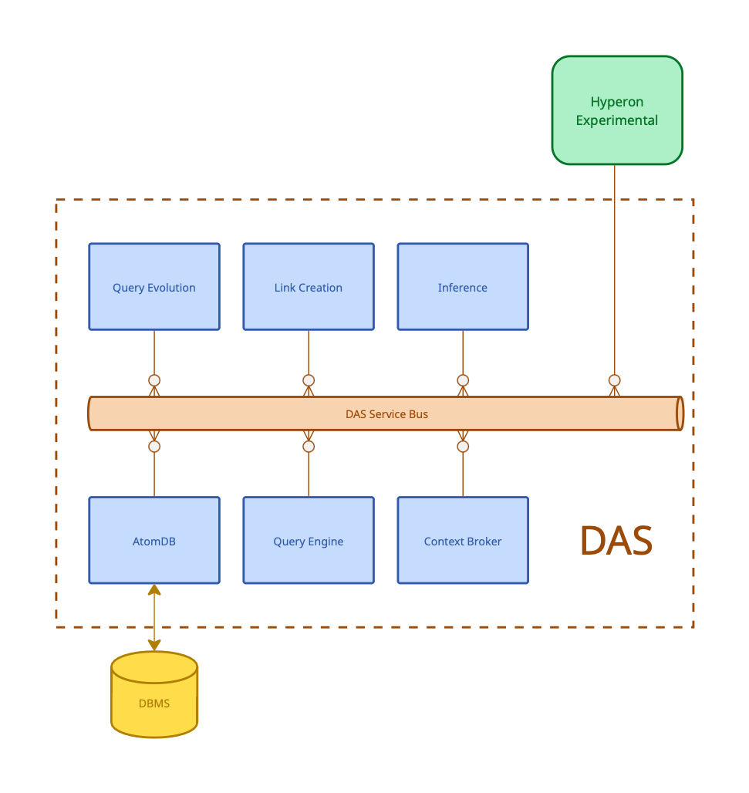

# Distributed Atomspace - Overview

Atomspace is the hypergraph OpenCog Hyperon uses to represent and store knowledge, being the source of knowledge for AI agents and the container of any computational result that might be created or achieved during their execution.

The Distributed Atomspace (DAS) is an extension of OpenCog Hyperon's Atomspace. It functions as an independent component, designed to facilitate multiple simultaneous connections with diverse AI algorithms.

Implemented as a MeTTa space, DAS offers a flexible query interface to distributed knowledge bases, responding similarly to other Hyperon spaces. However, DAS distinguishes itself by its ability to manage large knowledge bases through the internal use of various cognitive components. These components prioritize the most "promising" query results, leading to two key benefits. The results are ordered by their "promising" nature, from most to least. This allows the code processing the query to cease iteration and stop the query before full processing once an adequate number of "good" answers has been identified.

The way DAS prioritize and present query results can leverage AI/ML algorithms by considerably reducing the effect of combinatorial explosion. And this is the reason why DAS is more than just a persistence layer for Hyperon. In this document we explain how DAS components work together to achieve this goal.

## DAS components

{ width=500 style="display: block; margin: 0 auto;" }

DAS functions primarily as a query engine. Its architecture and components are specifically engineered to efficiently answer pattern matching queries. This design is crucial for timely responses, especially given that query results can expand combinatorially with the increasing size of the knowledge base stored in the AtomDB.

To avoid combinatorial explosion, the query engine dynamically prunes the search space using Short-term Importance (STI) values of atoms. These STI values are updated by multiple Economic Attention Networks (ECANs, see Chapter 5 of [this book](https://link.springer.com/book/10.2991/978-94-6239-030-0)) for a more detailed description), which are managed by an AttentionBroker component. The AttentionBroker maintains separate ECANs for different query contexts, enabling the assignment of independent STI values to atoms across these various contexts.

Beyond the Query Engine and Attention Broker, DAS incorporates specialized agents that offer specific APIs for various knowledge base tasks. Presently, these include the Evolution and Link Creation agents. An Inference agent is also under development.

Let's delve into the operational details of each component.

### AtomDB

AtomDB is where atoms are actually stored in DAS. It may be seen as a persistence layer but this may not be strictly true. Actually, AtomDB is just an abstract API which can be implemented in several different ways depending on the actual storage back-end being used. It’s like an abstract database API that provides a layer of abstraction over the underlying database technology. This abstraction allows DAS to interact with the AtomDB using a unified set of commands and methods, without needing to understand the specific details of the backend's implementation (e.g., one or more DBMSs, Mork, etc.).

An AtomDB primarily contains two types of data: atom attributes and indexes. The optimal backend choice depends on the knowledge base's nature and volume, as well as the application's query types. It’s also possible to use more than one DBMS in the backend. This is particularly useful to take advantage of complementary indexing capabilities of different DB engines.   

### Query Engine

The Query Engine supports two syntaxes for queries: MeTTa expressions or a vector of tokens. MeTTa expressions, such as (contains (sentence $s) (word $w)), are patterns that allow for nested expressions. The vector of tokens representation is a more general approach, similar to the Atomese used in Opencog classic. MeTTa expressions are mapped to "Expression" type links, while symbols are mapped to "Symbol" type nodes. Consequently, the MeTTa expression mentioned above would be represented by the following tokens: [LinkTemplate, Expression, 3, Node, Symbol, contains, LinkTemplate, Expression, 2, Node, Symbol, sentence, Variable, s, LinkTemplate, Expression, 2, Node, Symbol, word, Variable, w]. This can be indented for improved readability.

  ```
LinkTemplate Expression 3
    Node Symbol contains
    LinkTemplate Expression 2
        Node Symbol sentence
        Variable s
    LinkTemplate Expression 2
        Node Symbol word
        Variable w
```

In DAS terminology, these straightforward patterns are known as LinkTemplates. More intricate query expressions can be constructed by combining LinkTemplates with Boolean operators. For example, (or (contains $s (word “aaa”)) (contains $s (word “aaa”))). The Boolean operators "and," "or," and "not" can be used to create nested expressions with unlimited levels. These are referred to as query trees, as they can be visually represented as a tree structure where LinkTemplates are the leaves and Boolean operators are the internal nodes.

The Query Engine processes each query in 3 steps:

Query parsing
Execution planning
Query execution

The syntax used to represent the query is relevant only during the first step. From this point on, MeTTa or tokens query are processed in the same way.

After parsing a query, the Query Engine constructs a corresponding query tree, which acts as an execution plan. During this phase, the system can implement optimization strategies, such as reusing subtrees or pre-fetching data from the cache. Query trees are composed of three distinct element types: sources, operators, and sinks. Each element is an asynchronous and independent processing unit connected to other elements by a communication channel.

Sources are the leaves of the query tree. Typically they are a LinkTemplate and represent the points where the underlying AtomDB will be queried for candidate answers that match a given pattern. After fetching the candidate answers from the AtomDB, sources query the AttentionBroker for their STI values and attach these values to the candidates, which are then sorted by their STI in such a way that most important candidate answers (i.e. candidates that contain the most promising atoms) are prioritized. Candidate answers then flow up the query tree to the boolean operators.

Operators are the internal nodes in the query tree. They receive candidate answers from one or more sources and process them accordingly. Operators process their input considering the fact that candidates from a given source will always come sorted by STI. Candidate answers that satisfy each operator’s logic flow up the tree to the next element until a sink is reached.

Sinks are the root of the query tree. They mark the end of the query processing and are responsible for delivering the final query answers to the caller.

Query elements communicate via channels. These elements can be deployed in various configurations: as threads within the same process, as independent processes on the same server, or across different machines. The choice of communication channel - such as in-RAM shared queues, GRPC, or MQTT - depends on the deployment method. New communication channel types can be integrated with minimal effort.

Query execution begins once all query elements are in place and optimized. Candidate answers then flow through the query tree, starting from the source elements. Throughout this process, candidates with higher STI are prioritized (from the source to the sink, and then to the caller). The caller can then iterate through the query results or interrupt the query at any time.

### Attention Broker

Atoms may have a Short-term importance (STI) value attached to them. This is a number in [0..1] which is used in the query engine to prioritize which candidate answers will be processed and potentially passed through to the next query element first.

However, STI values are not stored in the AtomDB as atom’s property. They are kept in the AttentionBroker instead, in a specialized data structure which keeps different STI values for different contexts. Hence, the same atom can have multiple STI values depending on the context.

STI values are stored and updated according to the Economic Attention Allocation (ECAN) algorithm described in Chapter 5 of [this book](https://link.springer.com/book/10.2991/978-94-6239-030-0). The Attention Broker has an API to update and extend the Hebbian networks connecting the atoms of a context. DAS uses this API to build the Hebbian networks and to stimulate atoms according to their importance values and connectivity with other atoms in the Hebbian network.

Update of either, the Hebbian connections and the STI values can be performed implicitly while pattern matching queries are executed or can be explicitly requested by the user. 

Hebbian links' weights can be seen as the probability of a given atom being present in a query answer given that another atom is present in the same answer. Thus, when submitting a query to the Query Engine, the caller can set an optional parameter in the query to trigger the update of the Hebbian network related to a given context and the STI values of the atoms that appear in the query answers.

Explicit updating of the Hebbian networks is also possible. This way the caller can use regular links present in the atomspace as if they were Hebbian links. Explicit STI boosting and subsequent activation spreading can also be done explicitly by user's request using queries that are similar to the ones used for pattern matching. This makes the whole STI update process extremely flaxible and adaptable to different problem domains.

### Query Evolution

DAS provides an API to evolve answers that best match a query using an evolutionary algorithm.

The concept of "evolving" query answers, rather than simply "processing" them, stems from the potential for pattern-matching queries to yield millions or billions of results. Often, we are only interested in a select few answers that best meet specific criteria. However, identifying these optimal answers may require iterating through a vast number of possibilities, which can be impractical or infeasible.

By employing an optimization algorithm, we utilize the provided criteria as a fitness function. This guides the search through the vast space of potential query answers, aiming to identify those with high fitness values without needing to examine every possibility. Therefore, users are required to submit a query and a corresponding function to evaluate any potential answer.

A straightforward, albeit inefficient, approach would involve processing the query, evaluating all results against fitness functions, and then sorting them before presenting an iterator to the user. This would allow users to access query answers from highest to lowest fitness. However, this method is undesirable due to the necessity of visiting every query answer, which is precisely what we aim to circumvent.

Hence, the idea is to sort query answers in advance somehow in order to visit only the most promising ones. DAS already has means to do this: the Attention Broker. It uses atoms' importance value in a given context in order to sort the answers of a query before delivering them to the caller. However, Attention Broker uses solely atoms' importance as sorting criteria and atoms' importance is related to the frequency which each atom has been relevant to previous queries in the same context, it isn't related to any specific fitness measure.

So the idea here is to provide a way to use the "feedback" we implicitly get from the user regarding the quality of each query answer (i.e. the passed fitness function) in order to stimulate the importance of atoms in such a way that better answers' components (i.e. atoms) receive importance boosts, making the better answers being more likely of being selected earlier.

**The algorithm**

Our algorithm is inspired by [BOA: the Bayesian Optimization Algorithm](https://dl.acm.org/doi/10.5555/2933923.2933973) in the sense that it is an evolutionary algorithm which doesn't actually mix individuals from one generation to the next using genetic operators (e.g. crossover, mutation etc) but, instead, it samples the individuals of the population using probabilistic criteria at the beginning of each new generation.

However, we don't use anything like a Bayesian network, as in BOA. We just use the attention allocation performed by the Attention Broker (which uses Hebbian networks) and bias this allocation by stimuli spreading based on the quality of each query answer from one generation to the next. 

Here's a high level description of the algorithm.
 
Input: 

* `Q`: Pattern matching query
* `F`: Fitness function mapping from QueryAnswer objects to numbers in [0, 1] (0: useless answer, 1: best possible answer)

Output:

* An iterator to the best distinct QueryAnswers found by the algorithm
 
1. Determine evolution parameters
    a. `P` - Population size
    b. `M` - Number of individuals selected from the population at each generation in order to update the Attention Broker before the next generation is selected.
    c. `Stop criteria` (number of generations, target fitness value, minimal evolution in last n cycles, etc)
2. Sample a population `Population[]` by executing `Q` and iterating `P` times in the result.
3. Evaluate `F(Population[i])` for all individuals `Population[I]`.
4. Select `M` individuals from current population using their fitness value using some selection method (best `M`, roulette, tournament, etc)
5. Use selected individuals to update AttentionBroker.
6. Iterate steps 2., 3., 4.  and 5. until `Stop criteria` is matched. While Iterating, keep record of the best QueryAnswers.
7. Return an iterator to the best QueryAnswers recorded during the evolution process.
In the first generation, we select the first `P` QueryAnswers to compose our initial population. From this point on, we rely on the current relative importance of the atoms stored in the AttentionBroker
