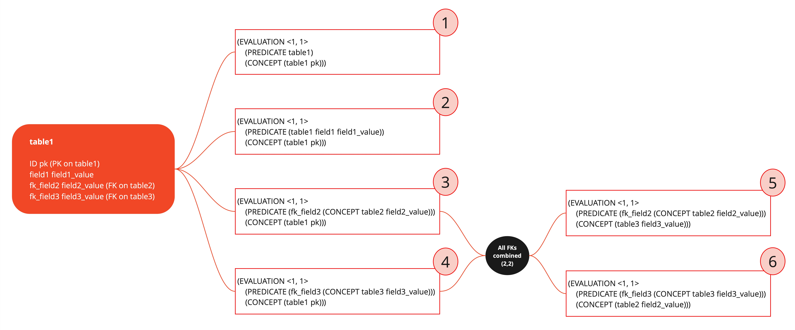
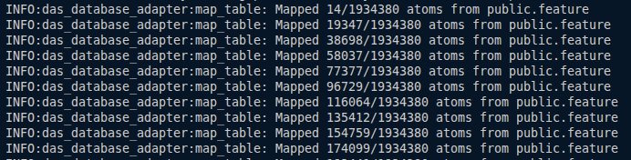

# Database Adapter - User's Guide

This guide will show you what Database Adapter is, how it works, and walk you through using it, enabling you to map data from a PostgreSQL database and load it into the DAS. The mapping logic used to convert SQL data to MeTTa expressions can be seen in the diagram below.

<p align="center">

</p>

---

## Table of Contents

- [Database Adapter - User's Guide](#database-adapter---users-guide)
  - [Table of Contents](#table-of-contents)
  - [Introduction](#introduction)
  - [Prerequisites](#prerequisites)
  - [Quickstart Example](#quickstart-example)
    - [1. Configure the DAS stack](#1-configure-the-das-stack)
      - [1. Install das-cli and start the DAS services](#1-install-das-cli-and-start-the-das-services)
      - [2. Clone the DAS repository and setting up the environment](#2-clone-the-das-repository-and-setting-up-the-environment)
      - [3. Build DAS components](#3-build-das-components)
      - [4. Run the AtomDBBroker](#4-run-the-atomdbbroker)
    - [2. Build and run the Database Adapter](#2-build-and-run-the-database-adapter)
      - [1. Clone the DAS Database Adapter repository](#1-clone-the-das-database-adapter-repository)
      - [2. Prepare Secrets and Context](#2-prepare-secrets-and-context)
      - [3. Build and run the Adapter](#3-build-and-run-the-adapter)
  - [Understanding the Context File](#understanding-the-context-file)
    - [Context Structures](#context-structures)
      - [**Structure 1: Table Filter (Recommended)**](#structure-1-table-filter-recommended)
      - [**Structure 2: Subquery Table (WIP)**](#structure-2-subquery-table-wip)
    - [Writing Your Own Context File](#writing-your-own-context-file)
  - [Troubleshooting and Tips](#troubleshooting-and-tips)

---

## Introduction

The DAS Database Adapter is a modular system designed to map data from SQL databases into Atoms (MeTTa symbols and expressions).
The main workflow involves cloning the [repository](https://github.com/singnet/das-database-adapter), configuring a context file to define the data mapping, and running the adapter passing the necessary parameters.

---

## Prerequisites

Before you begin, ensure you have the following tools installed and running:

- **Docker:** Essential for building and running the adapter in a containerized environment.
- **das-cli:** The DAS command-line interface. You can find installation instructions in the [das-cli User's Guide](das-cli-users-guide.md).

---

## Quickstart Example

This example maps data from the [FlyBase public PostgreSQL database](https://flybase.github.io/docs/chado/#public-database) using the provided context and secrets.

> [!NOTE]
> Currently, it is only possible to use the Database Adapter with scripts directly from the repository.
> In the future, a version of the Adapter will be integrated into `das-cli` to facilitate its use.

For the mapping and loading of data into DAS to work correctly, you need to follow these steps:

### 1. Configure the DAS stack

#### 1. Install das-cli and start the DAS services

Follow the instructions in the [das-cli User's Guide](das-cli-users-guide.md) to install `das-cli`.

- Configuring your DAS environment

```bash
das-cli config set
```

- Starting an AtomDB

  ```bash
  das-cli db start
  ```

- Starting the AttentionBroker

  ```bash
  das-cli attention-broker start
  ```

- Starting an Agent (QueryAgent for instance)

  **IMPORTANT:** The `<ip:port>` of the agent started here is used as `peer_id` to AtomDBBroker.

  ```bash
  das-cli query-agent start
  ```

  You will see this output in the terminal:

  ```bash
  Starting Query Agent service...
  Query Agent started on port 40002
  ```

#### 2. Clone the DAS repository and setting up the environment

  ```bash
  git clone https://github.com/singnet/das.git
  cd das
  ```

  You need to create a `.env` file in the `das` directory with the following content:

  ```bash
  DAS_REDIS_HOSTNAME=0.0.0.0
  DAS_REDIS_PORT=29000
  DAS_USE_REDIS_CLUSTER=False
  DAS_MONGODB_HOSTNAME=0.0.0.0
  DAS_MONGODB_PORT=28000
  DAS_MONGODB_USERNAME=dbadmin
  DAS_MONGODB_PASSWORD=dassecret
  ```

#### 3. Build DAS components

  ```bash
  make build-all
  ```

#### 4. Run the AtomDBBroker

  You need to pass the <ip:port> of the QueryAgent started before as `peer_id` to AtomDBBroker.

  ```bash
  make run-atomdb-broker OPTIONS="0.0.0.0:40007 44000:44999 0.0.0.0:40002"
  ```

  **IMPORTANT:** The `<ip:port>` of the AtomDBBroker is used as `peer_id` when running the adapter.

  You will see this output in the terminal:

  ```bash
  2025-11-07 19:44:31 | [INFO] | Starting AtomDB Broker server with id: 0.0.0.0:40007
  2025-11-07 19:44:31 | [INFO] | Using default MongoDB chunk size: 1000
  2025-11-07 19:44:31 | [INFO] | Connected to MongoDB at 0.0.0.0:28000
  2025-11-07 19:44:31 | [INFO] | WARNING: No pattern_index_schema found, all possible patterns will be created during link insertion!
  2025-11-07 19:44:31 | [INFO] | Connected to (NON-CLUSTER) Redis at 0.0.0.0:29000
  2025-11-07 19:44:31 | [INFO] | BUS static initialization
  2025-11-07 19:44:31 | [INFO] | BUS command: <atomdb>
  2025-11-07 19:44:31 | [INFO] | BUS command: <context>
  2025-11-07 19:44:31 | [INFO] | BUS command: <inference>
  2025-11-07 19:44:31 | [INFO] | BUS command: <link_creation>
  2025-11-07 19:44:31 | [INFO] | BUS command: <pattern_matching_query>
  2025-11-07 19:44:31 | [INFO] | BUS command: <query_evolution>
  2025-11-07 19:44:31 | [INFO] | Port range: [44000 : 44999]
  2025-11-07 19:44:31 | [INFO] | SynchronousGRPC listening on 0.0.0.0:40007
  2025-11-07 19:44:32 | [INFO] | BUS node 0.0.0.0:40007 is taking ownership of command atomdb
  2025-11-07 19:44:32 | [INFO] | #############################     REQUEST QUEUE EMPTY     ##################################
  ```

### 2. Build and run the Database Adapter

#### 1. Clone the DAS Database Adapter repository

```bash
git clone https://github.com/singnet/das-database-adapter.git
cd das-database-adapter
```

#### 2. Prepare Secrets and Context

Before running the adapter, you need to set up two configuration files: `secrets.ini` (with SQL database credentials) and `context.txt`.

- **secrets.ini**: Use the provided example at `./examples/secrets.ini`. It contains the database credentials:

```ini
[postgres]
username=flybase
password=
```

- **context.txt**: Use the provided example at `./examples/context.txt`. It defines what data to extract:

```txt
public.feature -[residues,seqlen,md5checksum] <uniquename LIKE 'FBgn%'><is_obsolete=false>
```

**NOTE:** The context files are better explained in the [Understanding the Context File](#understanding-the-context-file) section.

#### 3. Build and run the Adapter

Build the adapter's Docker image (in the das-database-adapter directory)

```bash
make build

make run \
  host=chado.flybase.org \
  port=5432 \
  db=flybase \
  secrets=$(pwd)/examples/secrets.ini \
  context=$(pwd)/examples/context.txt \
  peer_id=0.0.0.0:40007
```

If everything is configured correctly, the adapter will connect to the remote database, map the data as described in the context, and process it into MeTTa files in the specified output directory. You should see the generated output files in the current directory and terminal output similar to the one below:

<p align="center">

</p>

**After these steps, you will have your Postgres database properly loaded into DAS.**

---

## Understanding the Context File

The context file is the core of your data mapping. It precisely defines what data is fetched and how.

### Context Structures

There are two supported structures for context lines. Each line in the file is processed independently.

#### **Structure 1: Table Filter (Recommended)**

```txt
schema_name.table_name -[columns_to_exclude] <CLAUSE_1> <CLAUSE_2> ...
```

- `schema_name.table_name`: Fully qualified table name.
- `columns_to_exclude`: A comma-separated list of columns to exclude from the mapping.
- Each `<CLAUSE>`: A SQL WHERE clause (without `WHERE` keyword).
- Clauses are combined with `AND` operator.

**NOTE:** If you don't want to exclude any columns, you must pass `-[]`.

**Example:**

```txt
public.feature -[residues,seqlen,md5checksum] <is_obsolete=false><uniquename LIKE 'FBgn%'>
public.feature -[residues,seqlen,md5checksum] <is_obsolete=false><type_id IN (1179)>
public.cvterm -[definition] <is_obsolete=0>
public.feature_cvterm -[] <is_not=false><feature_id not IN ('11382573','11387545')>
```

This extracts:
- All rows from `public.feature` where `uniquename` starts with `'FBgn'` and `is_obsolete` is `false` plus all the rows where `type_id` is `1179` and `is_obsolete` is `false`, while skipping the `residues`, `seqlen`, and `md5checksum` columns
- All rows from `public.cvterm` where `is_obsolete` is `0`, while skipping the `definition` column.
- All rows from `public.feature_cvterm` where `is_not` is `false` and `feature_id` is not in the specified list, *without skipping any columns*.

#### **Structure 2: Subquery Table (WIP)**

**Warning:** This feature is [WIP](https://github.com/singnet/das/issues/684). For reliable mappings use **Structure 1**.

```txt
SQL custom_table_name <SQL_QUERY>
```

- `custom_table_name`: Any identifier you assign to this data set.
- `<SQL_QUERY>`: An SQL query enclosed in `<>`. Each column **must** use an alias in the form `schema_table__column`.

**NOTE:** The `schema_table__column` alias convention is mandatory for the adapter to track the origin of each data field.

**Example 1:**
```txt
SQL table_experiment_1 <SELECT grp.uniquename as public_grp__uniquename, grp.name as public_grp__name
FROM grp
JOIN grpmember ON grpmember.grp_id = grp.grp_id
JOIN feature_grpmember ON feature_grpmember.grpmember_id = grpmember.grpmember_id
JOIN feature ON feature.feature_id = feature_grpmember.feature_id
WHERE feature.name = 'Abd-B' AND feature.is_obsolete = 'f';>
```

**Example 2:**
```txt
SQL gene_expr_1 <select distinct
    feature.name as public_feature__name,
    feature.uniquename as public_feature__uniquename,
    library.uniquename as public_library__uniquename,
    library_featureprop.value as public_library_featureprop__value
from feature
join library_feature on library_feature.feature_id = feature.feature_id
join library on library.library_id = library_feature.library_id
left join library_featureprop on library_featureprop.library_feature_id = library_feature.library_feature_id
where library_featureprop.type_id = '151505' and
library.uniquename in (
'FBlc0003850', 'FBlc0003851', 'FBlc0003852', 'FBlc0003853', 'FBlc0003854', 
'FBlc0003855', 'FBlc0003856', 'FBlc0003857', 'FBlc0003858', 'FBlc0003859', 
'FBlc0003860', 'FBlc0003861', 'FBlc0003862', 'FBlc0003863', 'FBlc0003864', 
'FBlc0003865', 'FBlc0003866', 'FBlc0003867', 'FBlc0003868', 'FBlc0003869', 
'FBlc0003870', 'FBlc0003871', 'FBlc0003872', 'FBlc0003873', 'FBlc0003874');>
```

---

### Writing Your Own Context File

1.  **Identify** the tables and data you want to extract.
2.  **Decide** if a simple filter (Structure 1) is sufficient or if a custom query (Structure 2) is needed, remembering that Structure 2 is unstable and not recommended because it could lead to mapping errors.
3.  **Write** one context line per dataset you want to extract.
4.  **Always use** complete schema and table names and valid SQL syntax.

---

## Troubleshooting and Tips

-   **Connection errors?** Double-check your `secrets.ini` and the database host/port parameters in the `make run` command.
-   **No data mapped?** Review your `context.txt` for typos, incorrect table/column names, or query logic.
-   **Custom context not working?** Remember that Structure 2 (Subquery) is unstable. Check that your SQL query uses the `schema_table__column` alias format correctly. Preferably use Structure 1.

---
