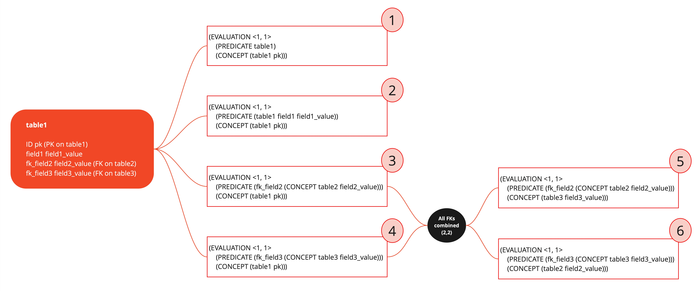
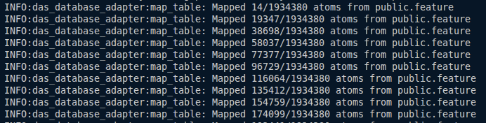

# Database Adapter - User's Guide

This guide will show you what Database Adapter is, how it works, and walk you through using it, enabling you to map data from a PostgreSQL database and load it into the DAS. The mapping logic used to convert SQL data to MeTTa expressions can be seen in the diagram below.

<p align="center">

</p>

---

## Table of Contents

- [Database Adapter - User's Guide](#database-adapter---users-guide)
  - [Table of Contents](#table-of-contents)
  - [Introduction](#introduction)
  - [Prerequisites](#prerequisites)
  - [Quickstart Example](#quickstart-example)
    - [1. Configure the environment](#1-configure-the-environment)
      - [1. Prepare Secrets and Context](#1-prepare-secrets-and-context)
      - [2. Start DAS Services](#2-start-das-services)
    - [3. Run the adapter](#3-run-the-adapter)
  - [Understanding the Context File](#understanding-the-context-file)
    - [Context Structures](#context-structures)
      - [**Structure 1: Table Filter (Recommended)**](#structure-1-table-filter-recommended)
      - [**Structure 2: Subquery Table (WIP)**](#structure-2-subquery-table-wip)
    - [Writing Your Own Context File](#writing-your-own-context-file)
  - [Troubleshooting and Tips](#troubleshooting-and-tips)

---

## Introduction

The DAS Database Adapter is a modular system designed to map data from SQL databases into Atoms (MeTTa symbols and expressions).
The primary workflow involves cloning the [repository](https://github.com/singnet/das-database-adapter), configuring a context file to define the data mapping, and running the adapter passing the necessary parameters.

---

## Prerequisites

Before you begin, ensure you have the **das-cli** DAS command-line interface tool installed and running. You can find installation instructions in the [das-cli User's Guide](das-cli-users-guide.md).

---

## Quickstart Example

This example maps data from the [FlyBase public PostgreSQL database](https://flybase.github.io/docs/chado/#public-database) using the provided context and secrets.

### 1. Configure the environment

Before running the adapter, you need to set up two configuration files: `secrets.ini` (with SQL database credentials) and `context.txt`. And run the DAS services.

#### 1. Prepare Secrets and Context

- **secrets.ini**: Use the provided example at. `./examples/secrets.ini`. It contains the database credentials:

```ini
[postgres]
username=flybase
password=
```

- **context.txt**: Use the provided example at `./examples/context.txt`. It defines what data to extract:

```txt
public.feature -[residues,seqlen,md5checksum] <uniquename LIKE 'FBgn%'><is_obsolete=false>
```

**NOTE :** The context files are better explained in the [Understanding the Context File](#understanding-the-context-file) section.

#### 2. Start DAS Services

Make sure the DAS services are running before executing the adapter. For more details on starting DAS services, see the official [documentation](das-cli-users-guide.md).

- Start the DAS backend DBMS

```bash
das-cli db start
```

- Start the service that will load the data into DAS.

```bash
das-cli atomdb-broker start
```

**NOTE :** For the service above to start correctly, you need start the agent bellow:

```bash
das-cli attention-broker start
das-cli query-agent start
```

**IMPORTANT :** The `atomdb-broker` service is required for the Database Adapter to function correctly. Use it as peer_id when running the adapter.

### 3. Run the adapter

Pass the connection parameters and paths to your configuration files.

```bash
das-cli db-adapter run host=chado.flybase.org port=5432 db=flybase secrets=$(pwd)/examples/secrets.ini context=$(pwd)/examples/context.txt peer_id=localhost:40007
```

If everything is configured correctly, the adapter will connect to the remote database, map the data as described in the context, and load it into DAS via `atomdb-broker`. You should see the generated output files in the current directory and terminal output similar to the one below:

<p align="center">

</p>

**After these steps, you will have your Postgres database properly loaded into DAS.**

---

## Understanding the Context File

The context file is the core of your data mapping. It precisely defines what data is fetched and how.

### Context Structures

There are two supported structures for context lines. Each line in the file is processed independently.

#### **Structure 1: Table Filter (Recommended)**

```txt
schema_name.table_name -[columns_to_exclude] <CLAUSE_1> <CLAUSE_2> ...
```

- `schema_name.table_name`: Fully qualified table name.
- `columns_to_exclude`: A comma-separated list of columns to exclude from the mapping.
- Each `<CLAUSE>`: A SQL WHERE clause (without `WHERE` keyword).
- Clauses are combined with `AND` operator.

**Note:** If you don't want to exclude any columns, you must pass `-[]`.

**Example:**

```txt
public.feature -[residues,seqlen,md5checksum] <is_obsolete=false><uniquename LIKE 'FBgn%'>
public.feature -[residues,seqlen,md5checksum] <is_obsolete=false><type_id IN (1179)>
public.cvterm -[definition] <is_obsolete=0>
public.feature_cvterm -[] <is_not=false><feature_id not IN ('11382573','11387545')>
```

This extracts:
- All rows from `public.feature` where `uniquename` starts with `'FBgn'` and `is_obsolete` is `false` plus all the rows where `type_id` is `1179` and `is_obsolete` is `false`, while skipping the `residues`, `seqlen`, and `md5checksum` columns
- All rows from `public.cvterm` where `is_obsolete` is `0`, while skipping the `definition` column.
- All rows from `public.feature_cvterm` where `is_not` is `false` and `feature_id` is not in the specified list, *without skipping any columns*.

#### **Structure 2: Subquery Table (WIP)**

**Warning:** This feature is [WIP](https://github.com/singnet/das/issues/684). For reliable mappings use **Structure 1**.

```txt
SQL custom_table_name <SQL_QUERY>
```

- `custom_table_name`: Any identifier you assign to this data set.
- `<SQL_QUERY>`: An SQL query enclosed in `<>`. Each column **must** use an alias in the form `schema_table__column`.

**Note:** The `schema_table__column` alias convention is mandatory for the adapter to track the origin of each data field.

**Example 1:**
```txt
SQL table_experiment_1 <SELECT grp.uniquename as public_grp__uniquename, grp.name as public_grp__name
FROM grp
JOIN grpmember ON grpmember.grp_id = grp.grp_id
JOIN feature_grpmember ON feature_grpmember.grpmember_id = grpmember.grpmember_id
JOIN feature ON feature.feature_id = feature_grpmember.feature_id
WHERE feature.name = 'Abd-B' AND feature.is_obsolete = 'f';>
```

**Example 2:**
```txt
SQL gene_expr_1 <select distinct
    feature.name as public_feature__name,
    feature.uniquename as public_feature__uniquename,
    library.uniquename as public_library__uniquename,
    library_featureprop.value as public_library_featureprop__value
from feature
join library_feature on library_feature.feature_id = feature.feature_id
join library on library.library_id = library_feature.library_id
left join library_featureprop on library_featureprop.library_feature_id = library_feature.library_feature_id
where library_featureprop.type_id = '151505' and
library.uniquename in (
'FBlc0003850', 'FBlc0003851', 'FBlc0003852', 'FBlc0003853', 'FBlc0003854', 
'FBlc0003855', 'FBlc0003856', 'FBlc0003857', 'FBlc0003858', 'FBlc0003859', 
'FBlc0003860', 'FBlc0003861', 'FBlc0003862', 'FBlc0003863', 'FBlc0003864', 
'FBlc0003865', 'FBlc0003866', 'FBlc0003867', 'FBlc0003868', 'FBlc0003869', 
'FBlc0003870', 'FBlc0003871', 'FBlc0003872', 'FBlc0003873', 'FBlc0003874');>
```

---

### Writing Your Own Context File

1.  **Identify** the tables and data you want to extract.
2.  **Decide** if a simple filter (Structure 1) is sufficient or if a custom query (Structure 2) is needed, remembering that Structure 2 is unstable and not recommended because it could lead to mapping errors.
3.  **Write** one context line per dataset you want to extract.
4.  **Always use** complete schema and table names and valid SQL syntax.

---

## Troubleshooting and Tips

-   **Connection errors?** Double-check your `secrets.ini` and the database host/port parameters in the `make run` command.
-   **No data mapped?** Review your `context.txt` for typos, incorrect table/column names, or query logic.
-   **Custom context not working?** Remember that Structure 2 (Subquery) is unstable. Check that your SQL query uses the `schema_table__column` alias format correctly. Preferably use Structure 1.

---
