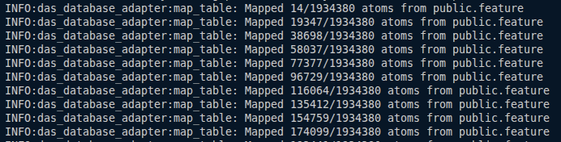

# DatabaseWrapper - User's Guide

This guide will show you what DatabaseWrapper is, how it works, and walk you through using it, enabling you to map data from a PostgreSQL database into MeTTa expressions and interact with the DAS ecosystem. The mapping logic used to convert SQL data to MeTTa expressions can be seen in the diagram below.

<p align="center">

</p>

---

## Table of Contents

- [DatabaseWrapper - User's Guide](#databasewrapper---users-guide)
  - [Table of Contents](#table-of-contents)
  - [Introduction](#introduction)
  - [Prerequisites](#prerequisites)
  - [Quickstart Example](#quickstart-example)
    - [1. Clone the Repository](#1-clone-the-repository)
    - [2. Prepare Secrets and Context](#2-prepare-secrets-and-context)
    - [3. Build and Run](#3-build-and-run)
    - [4. Reviewing the Generated Files](#4-reviewing-the-generated-files)
  - [Understanding the Context File](#understanding-the-context-file)
    - [Context Structures](#context-structures)
      - [**Structure 1: Table Filter (Recommended)**](#structure-1-table-filter-recommended)
      - [**Structure 2: Subquery Table (WIP)**](#structure-2-subquery-table-wip)
    - [Writing Your Own Context File](#writing-your-own-context-file)
  - [Load the mapped data into the DAS](#load-the-mapped-data-into-the-das)
    - [das-cli installation](#das-cli-installation)
    - [Running the database container and loading data](#running-the-database-container-and-loading-data)
      - [das-cli settings](#das-cli-settings)
      - [To load the data into DAS](#to-load-the-data-into-das)
  - [Troubleshooting and Tips](#troubleshooting-and-tips)

---

## Introduction

The DAS Database Adapter is a modular system designed to map data from SQL databases into Atoms (MeTTa symbols and expressions).
The primary workflow involves cloning the [repository](https://github.com/singnet/das-database-adapter), configuring a context file to define the data mapping, and running the adapter to generate `.metta` files.

These `.metta` files can then be loaded into the Distributed AtomSpace (DAS) using the [`das-cli`](https://github.com/singnet/das-toolbox), the command-line tool for interacting with the DAS ecosystem.

---

## Prerequisites

Before you begin, ensure you have the following tools installed and running:

- **Docker** Essential for building and running the adapter in a containerized environment.
- **das-cli** The DAS command-line interface. While not used to *generate* MeTTa files with this adapter, it is **required for the next step**: loading the data into DAS. ([See das-toolbox](https://github.com/singnet/das-toolbox) for installation guidelines).

---

## Quickstart Example

This example maps data from the [FlyBase public PostgreSQL database](https://flybase.github.io/docs/chado/#public-database) using the provided context and secrets.

### 1. Clone the Repository

```bash
git clone git@github.com:singnet/das-database-adapter.git
cd das-database-adapter
```

### 2. Prepare Secrets and Context

- **secrets.ini**: Use the provided example at. `./examples/secrets.ini`. It contains the database credentials:

  ```ini
  [postgres]
  username=flybase
  password=
  ```

- **context.txt**: Use the provided example at `./examples/context.txt`. It defines what data to extract:

  ```txt
  public.feature -[residues,seqlen,md5checksum] <uniquename LIKE 'FBgn%'><is_obsolete=false>
  ```

  **NOTE :** The context files are better explained in the [Understanding the Context File](#understanding-the-context-file) section.

### 3. Build and Run

Use the `make` commands to build the Docker image and run the adapter. Pass the connection parameters and paths to your configuration files.

```bash
# Build the adapter's Docker image
make build

# Run the adapter
make run host=chado.flybase.org port=5432 db=flybase secrets=$(pwd)/examples/secrets.ini context=$(pwd)/examples/context.txt output=$(pwd)/
```

If everything is configured correctly, the adapter will connect to the remote database, map the data as described in the context, and process it into MeTTa files in the specified output directory. You should see the generated output files in the current directory and terminal output similar to the one below:

<p align="center">

</p>

**After these steps, you will have your Postgres database properly translated into MeTTa files.**

### 4. Reviewing the Generated Files

After execution, several directories will be created, where each directory represents a table that was mapped according to the passed context and each directory will contain one or more `.metta` files. This files contains your SQL data translated into the MeTTa format. Each record in the table becomes a MeTTa expression, as shown in the [image](#databasewrapper---users-guide). See an example of a generated `.metta` file bellow:


```metta
(EVALUATION (PREDICATE (public.feature public.feature.is_analysis "False")) (CONCEPT (public.feature "100182789")))
(EVALUATION (PREDICATE (public.feature public.feature.is_analysis "False")) (CONCEPT (public.feature "100182790")))
(EVALUATION (PREDICATE (public.feature public.feature.is_analysis "False")) (CONCEPT (public.feature "100182979")))
(EVALUATION (PREDICATE (public.feature public.feature.is_analysis "False")) (CONCEPT (public.feature "100182980")))
(EVALUATION (PREDICATE (public.feature public.feature.is_analysis "False")) (CONCEPT (public.feature "1005074")))
(EVALUATION (PREDICATE (public.feature public.feature.is_analysis "False")) (CONCEPT (public.feature "100572913")))
(EVALUATION (PREDICATE (public.feature public.feature.is_analysis "False")) (CONCEPT (public.feature "1013")))
(EVALUATION (PREDICATE (public.feature public.feature.is_analysis "False")) (CONCEPT (public.feature "101601525")))
(EVALUATION (PREDICATE (public.feature public.feature.is_analysis "False")) (CONCEPT (public.feature "101601526")))
(EVALUATION (PREDICATE (public.feature public.feature.is_analysis "False")) (CONCEPT (public.feature "101601527")))
```

---

## Understanding the Context File

The context file is the core of your data mapping. It precisely defines what data is fetched and how.

### Context Structures

There are two supported structures for context lines. Each line in the file is processed independently.

#### **Structure 1: Table Filter (Recommended)**

```txt
schema_name.table_name -[columns_to_exclude] <CLAUSE_1> <CLAUSE_2> ...
```

- `schema_name.table_name`: Fully qualified table name.
- `columns_to_exclude`: A comma-separated list of columns to exclude from the mapping.
- Each `<CLAUSE>`: A SQL WHERE clause (without `WHERE` keyword).
- Clauses are combined with `AND` operator.

**Note:** If you don't want to exclude any columns, you must pass `-[]`.

**Example:**

```txt
public.feature -[residues,seqlen,md5checksum] <is_obsolete=false><uniquename LIKE 'FBgn%'>
public.feature -[residues,seqlen,md5checksum] <is_obsolete=false><type_id IN (1179)>
public.cvterm -[definition] <is_obsolete=0>
public.feature_cvterm -[] <is_not=false><feature_id not IN ('11382573','11387545')>
```

This extracts:
- All rows from `public.feature` where `uniquename` starts with `'FBgn'` and `is_obsolete` is `false` plus all the rows where `type_id` is `1179` and `is_obsolete` is `false`, while skipping the `residues`, `seqlen`, and `md5checksum` columns
- All rows from `public.cvterm` where `is_obsolete` is `0`, while skipping the `definition` column.
- All rows from `public.feature_cvterm` where `is_not` is `false` and `feature_id` is not in the specified list, *without skipping any columns*.

#### **Structure 2: Subquery Table (WIP)**

**Warning:** This feature is [WIP](https://github.com/singnet/das/issues/684). For reliable mappings use **Structure 1**.

```txt
SQL custom_table_name <SQL_QUERY>
```

- `custom_table_name`: Any identifier you assign to this data set.
- `<SQL_QUERY>`: An SQL query enclosed in `<>`. Each column **must** use an alias in the form `schema_table__column`.

**Note:** The `schema_table__column` alias convention is mandatory for the adapter to track the origin of each data field.

**Example 1:**
```txt
SQL table_experiment_1 <SELECT grp.uniquename as public_grp__uniquename, grp.name as public_grp__name
FROM grp
JOIN grpmember ON grpmember.grp_id = grp.grp_id
JOIN feature_grpmember ON feature_grpmember.grpmember_id = grpmember.grpmember_id
JOIN feature ON feature.feature_id = feature_grpmember.feature_id
WHERE feature.name = 'Abd-B' AND feature.is_obsolete = 'f';>
```

**Example 2:**
```txt
SQL gene_expr_1 <select distinct
    feature.name as public_feature__name,
    feature.uniquename as public_feature__uniquename,
    library.uniquename as public_library__uniquename,
    library_featureprop.value as public_library_featureprop__value
from feature
join library_feature on library_feature.feature_id = feature.feature_id
join library on library.library_id = library_feature.library_id
left join library_featureprop on library_featureprop.library_feature_id = library_feature.library_feature_id
where library_featureprop.type_id = '151505' and
library.uniquename in (
'FBlc0003850', 'FBlc0003851', 'FBlc0003852', 'FBlc0003853', 'FBlc0003854', 
'FBlc0003855', 'FBlc0003856', 'FBlc0003857', 'FBlc0003858', 'FBlc0003859', 
'FBlc0003860', 'FBlc0003861', 'FBlc0003862', 'FBlc0003863', 'FBlc0003864', 
'FBlc0003865', 'FBlc0003866', 'FBlc0003867', 'FBlc0003868', 'FBlc0003869', 
'FBlc0003870', 'FBlc0003871', 'FBlc0003872', 'FBlc0003873', 'FBlc0003874');>
```

---

### Writing Your Own Context File

1.  **Identify** the tables and data you want to extract.
2.  **Decide** if a simple filter (Structure 1) is sufficient or if a custom query (Structure 2) is needed, remembering that Structure 1 is recommended.
3.  **Write** one context line per dataset you want to extract.
4.  **Always use** complete schema and table names and valid SQL syntax.

---

## Load the mapped data into the DAS

Once the data mapping is complete and the `.metta` files have been generated, you can load them into DAS using the `das-cli`.

### das-cli installation

Installation via APT package is recommended.

- Set up the repository:
```bash
sudo bash -c "wget -O - http://45.77.4.33/apt-repo/setup.sh | bash"
```
- Install the package:
```bash
sudo apt install das-cli
```
- Check installation:
```bash
das-cli --version
```

- **NOTE :** For more details on installing `das-cli`, see the official [documentation](https://github.com/singnet/das-toolbox/blob/master/das-cli/README.md#installation).

### Running the database container and loading data

#### das-cli settings

```bash
das-cli config set
```

To load MeTTa files into the database, only the first few configurations are required. You can accept the default port number or specify your own. See below:

```bash
Enter Redis port [40020]:
Is it a Redis cluster? [y/N]: N
Enter MongoDB port [40021]:
Enter MongoDB username [admin]:
Enter MongoDB password [admin]:
Is it a MongoDB cluster? [y/N]: N
```

**NOTE:** Other settings after the ones above you can ignore them, just press enter.

#### To load the data into DAS

You need to start the DAS internal database and then load the `.metta` files generated by the DatabaseWrapper. Use the following commands:

```bash
das-cli db start
das-cli metta load /absolute/path/to/your/file.metta
```

---

## Troubleshooting and Tips

-   **Connection errors?** Double-check your `secrets.ini` and the database host/port parameters in the `make run` command.
-   **No data mapped?** Review your `context.txt` for typos, incorrect table/column names, or query logic.
-   **Custom context not working?** Remember that Structure 2 (Subquery) is unstable. Check that your SQL query uses the `schema_table__column` alias format correctly. Preferably use Structure 1.

---
