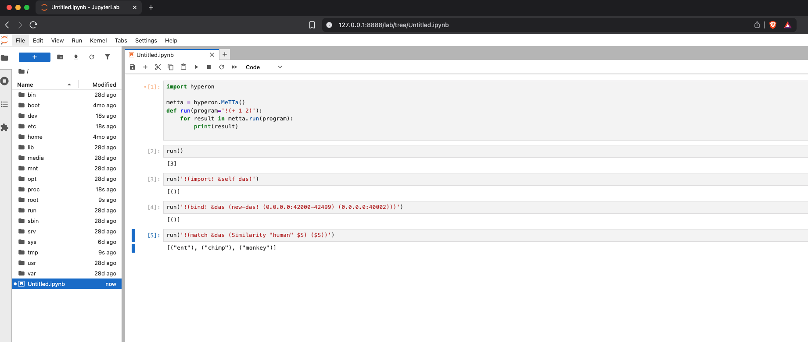

## Using JupyterLab to interact with HE DAS module

### Install `das-toolbox` in order to get `das-cli` (Debian based Linux users):
```
sudo apt -y update
sudo apt -y install wget

wget -O - http://45.77.4.33/apt-repo/setup.sh | sudo bash

sudo apt -y install das-toolbox

# >= 0.5.0
das-cli --version
```

You can also run `das-cli` from source, using python3 (other OS):
```
git clone https://github.com/singnet/das-toolbox.git

cd das-toolbox
git checkout tags/0.5.0

# Optional - Create a virtual env
python3 -m venv .venv
source .venv/bin/activate

pip3 install -r das-cli/src/requirements.txt
pip3 install -e das-cli/src/
```

1. Set up `das-cli` configurations
```
das-cli config set
# Or
python3 das-cli/src/das_cli.py config set

# NOTE: Be sure to set Attention Broker's port to 37007
# For all other prompts, you can just hit ENTER

>>>
Enter Redis port [40020]: 
Is it a Redis cluster? [y/N]: 
Enter MongoDB port [40021]: 
Enter MongoDB username [admin]: 
Enter MongoDB password [admin]: 
Is it a MongoDB cluster? [y/N]: 
Enter Jupyter Notebook port [40019]: 
Enter the Attention Broker port [40001]: 37007 <--- HERE
Enter the Query Agent port [40002]: 
Enter the Link Creation Agent Server port [40003]: 
Enter the Link Creation Agent buffer file [/tmp/requests_buffer.bin]: 
Enter the Link Creation Agent request interval (in seconds) [1]: 
Enter the Link Creation Agent thread count [1]: 
Enter the Link Creation Agent default timeout (in seconds) [10]: 
Do you want to save links to a Metta file? [Y/n]: 
Do you want to save links to the database? [Y/n]: 
Enter the Inference Agent port [40004]: 
Enter the Evolution agent port [40005]: 
Configuration file saved -> /home/gontijo/.das

```

2. Start Databases
```
das-cli db start
# Or
python3 das-cli/src/das_cli.py db start

>>>
Starting Redis service...
Redis has started successfully on port 40020 at localhost, operating under the server user arturgontijo.
Starting MongoDB service...
MongoDB has started successfully on port 40021 at localhost, operating under the server user arturgontijo.
```

3. Load Databases with `animals.metta` content:
```
# We need the metta file's absolute path, moving it to /tmp for convinience
curl https://raw.githubusercontent.com/singnet/das-toolbox/refs/heads/master/das-cli/src/examples/data/animals.metta -o /tmp/animals.metta

# Then
das-cli metta load /tmp/animals.metta
# Or
python3 das-cli/src/das_cli.py metta load /tmp/animals.metta

>>>
das-cli-mongodb-40021 is running on port 40021
das-cli-redis-40020 is running on port 40020
Loading metta file /tmp/animals.metta...
Connecting to Redis at localhost:40020
Connecting to MongoDB at localhost:40021
Done.
```

4. Start Attention Broker service
```
das-cli ab start
# Or
python3 das-cli/src/das_cli.py ab start

>>>
Starting Attention Broker service...
Attention Broker started on port 37007
```

5. Start Query Broker service
```
das-cli qa start
# Or
python3 das-cli/src/das_cli.py qa start

>>>
# Chose a port range (using 52000:52999)
Enter port range (e.g., 3000:3010): 52000:52999
Starting Query Agent service...
Query Agent started on port 40002
```

6. Running JupyterLab
```
# Build the Docker image
cd src/docker/JupyterLab
docker build -t trueagi/hyperon:jupyterlab . -f Dockerfile.jupyterlab

# (Optional) Set a different JupyterLab port (default is 8888)
docker build --build-arg PORT=7777 -t trueagi/hyperon:jupyterlab . -f Dockerfile.jupyterlab

# Run the container
docker run --name HE_DAS_JUPYTERLAB --network=host -d trueagi/hyperon:jupyterlab
```

7. Access the JupyterLab frontend in your browser:
You should be able to access the JupyterLab at:
http://127.0.0.1:8888/lab

8. Run simple queries on JupyterLab:
```python
import hyperon

metta = hyperon.MeTTa()
def run(program='!(+ 1 2)'):
    for result in metta.run(program):
        print(result)
```
Set up DAS module and connect to the DAS network:
```
run('!(import! &self das)')
run('!(bind! &das (new-das! (0.0.0.0:42000-42999) (0.0.0.0:40002)))')
```
From now on you can run queries on the `&das` space:
```
run('!(match &das (Similarity "human" $S) ($S))')
>>>
[("ent"), ("chimp"), ("monkey")]
```



9. Stop all services (removing their containers)
```
das-cli qa stop
das-cli ab stop
das-cli db stop

# Or
python3 das-cli/src/das_cli.py qa stop
python3 das-cli/src/das_cli.py ab stop
python3 das-cli/src/das_cli.py db stop

# Remove JupyterLab container
docker rm -f HE_DAS_JUPYTERLAB
```