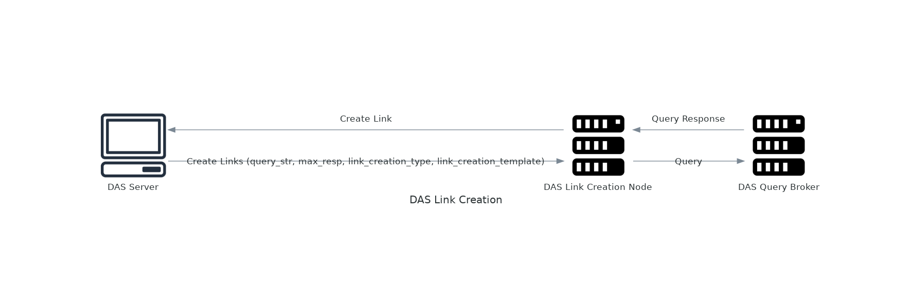
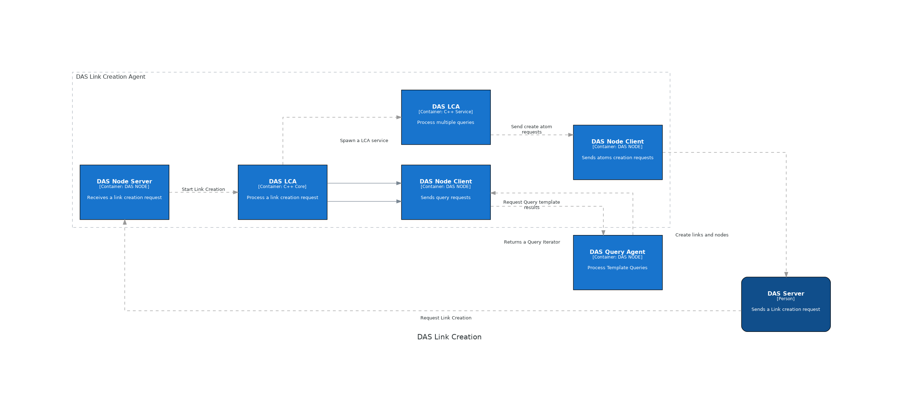

# DAS Link Creation Agent


<!--  -->

DAS Link Creation Agent (DAS LCA), process a query and create links using the result of the query and a custom template. The service can execute n times a request to update the database with relevant links over the time.



Query Example

```
LINK_TEMPLATE Expression 3 
    NODE Symbol feature_id 
    LINK_TEMPLATE Expression 2 
        NODE Symbol member 
        VARIABLE V1 
        LINK_TEMPLATE Expression 2 
            NODE Symbol feature 
            VARIABLE V2
```

Example of template for link creation:

```
LINK_CREATE Similarity 3
    VARIABLE V1 
    VARIABLE V2
    CUSTOM 2
        strength 0.1
        color red

```


## How to build


## Development